# 👋 Hi, I'm Daksh Vashistha
### 💻 CSE Student • Systems & HPC Enthusiast • Full-Stack Developer

[-1793D1?style=for-the-badge&logo=archlinux&logoColor=white)](https://archlinux.org)

 

<!-- Interactive Linux Terminal Animation -->

 

---

### 📂 ~/projects

Direct access links and stack details for the repositories featured in the terminal:

<!-- START_SECTION:projects -->
| Project | Description | Stack | Link |
| :--- | :--- | :--- | :--- |
| **[linux-server-health-audit](https://github.com/DAX-Quantum/linux-server-health-audit)** | Automated server health auditor monitoring CPU, memory, storage, and active services with status alerts. | `Bash` `Linux` |  |
| **[linux-system-info-tool](https://github.com/DAX-Quantum/linux-system-info-tool)** | Interactive CLI utility for querying hardware specifications, kernel versions, and OS telemetry. | `Bash` `Linux` |  |
| **[Student_Record_System](https://github.com/DAX-Quantum/Student_Record_System)** | CLI database management tool to store, search, update, and persist student academic records. | `C++` `File I/O` |  |
| **[Comic_book](https://github.com/DAX-Quantum/Comic_book)** | Responsive comic book showcase and reader web application with catalog browsing. | `React` `JavaScript` `CSS3` |  |
| **[finanace-manager](https://github.com/DAX-Quantum/finanace-manager)** | FinVault personal expense & finance management web application. | `JavaScript` `HTML5` `CSS3` |  |
<!-- END_SECTION:projects -->
 

### 🛠️ skills --list

<table>
  <tr>
    <td width="25%"><strong>Languages</strong></td>
    <td><code>C++</code>, <code>C</code>, <code>JavaScript</code>, <code>Bash</code>
  </tr>
  <tr>
    <td width="25%"><strong>Frontend & Web</strong></td>
    <td><code>React</code>, <code>HTML5</code>, <code>CSS3</code></td>
  </tr>
  <tr>
    <td width="25%"><strong>Systems & DevOps</strong></td>
    <td><code>Arch Linux</code>, <code>Rocky Linux</code>, <code>Docker</code>, <code>Git</code>, <code>HPC concepts</code></td>
  </tr>
  <tr>
    <td width="25%"><strong>Developer Tools</strong></td>
    <td><code>Neovim</code>, <code>VS Code</code>, <code>Bash Scripting</code></td>
  </tr>
</table>

 

### 📫 ./contact.sh

Have a question, collaboration idea, or project to discuss? Feel free to reach out:

- 🐙 **GitHub:** [@DAX-Quantum](https://github.com/DAX-Quantum)
- 💼 **LinkedIn:** [Daksh Vashistha](https://linkedin.com/in/daksh-vashistha-483a29420)
- ✉️ **Email:** [Dax.in@outlook.com](mailto:Dax.in@outlook.com)

---

Terminal animation generated with <a href="generate_terminal.py"><code>generate_terminal.py</code></a> • Designed with Tokyo Night aesthetics

